# IDEA 插件收集

>工欲善其事必先利其器，一款好的开发工具不但能大大缩减我们编码的时间，而且能使我们规范开发，还能秀出操作。本文将简单介绍一些本人见识过的开发工具。

写在前面：插件查找菜单 >>>>> File->Settings->Plugins，并按照下文中的插件名称进行搜索
官网插件库：https://plugins.jetbrains.com/ 
# 一、代码规范检测类
### 1.Alibaba Java Coding Guidelines  ✔
>为了让开发者更加方便、快速将规范推动并实行起来，阿里巴巴基于手册内容，研发了一套自动化的IDE检测插件（IDEA、Eclipse）。该插件在扫描代码后，将不符合规约的代码按Blocker/Critical/Major三个等级显示在下方，甚至在IDEA上，我们还基于Inspection机制提供了实时检测功能，编写代码的同时也能快速发现问题所在。

1.在**Tools->阿里编码规范**中未开启实时监测功能，可通过在java文件中直接右击选择“**编码规则扫描**”，可在**Inspection Results**中查看不规范信息。
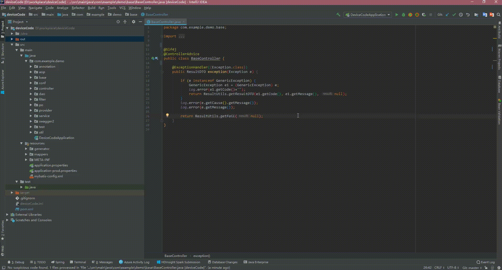

2.在**Tools->阿里编码规范**中开启实时监测功能,在不规范的代码中，插件将会用波浪线提示。这时可直接将鼠标坐标处于在波浪线上的代码处，通过快捷键**ALT+ENTER**，进行快速修复。

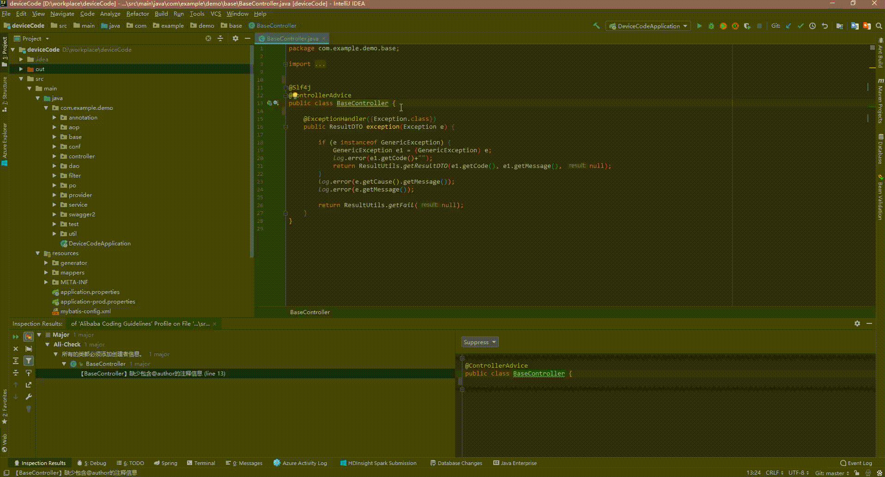

### 2.CheckStyle-IDEA   ✔
checkstyle官网地址http://checkstyle.sourceforge.net/
当然每家公司可能会有自己的代码规范，这时候不妨考虑下CheckStyle。
1.在**File->Setting->Editor->CheckStyle**中选择是否进行实时检查。
（1） 实时检查，实时地对不规范的书写进行提示 ，并在编辑页面中进行颜色标识。 
（2） 取消实时检查后，可在打开的文件中右击选择Check Current File对当前页面进行检查，此时可在** CheckStyle Scan** 面板中查看不规范内容，点击条目可查看对应出错语句。 
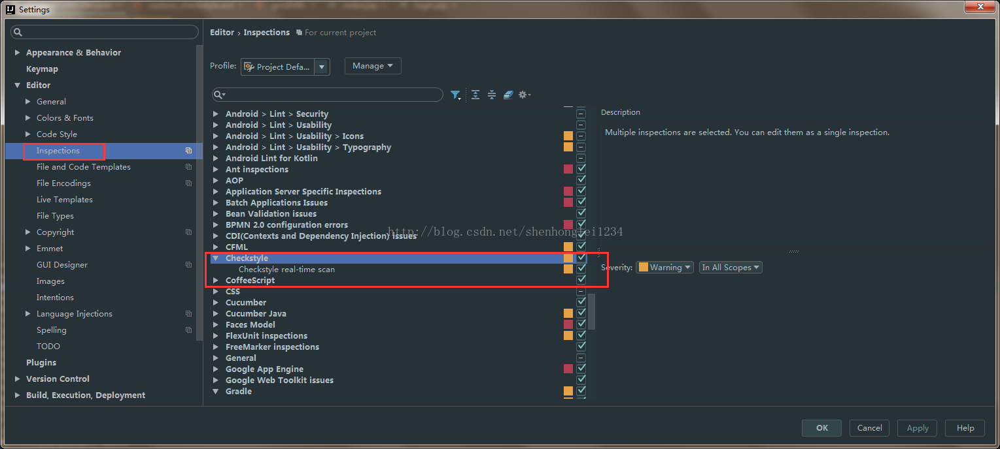

2.在**File->Setting->Other Setting->checkStyle**中配置自定义的代码规范
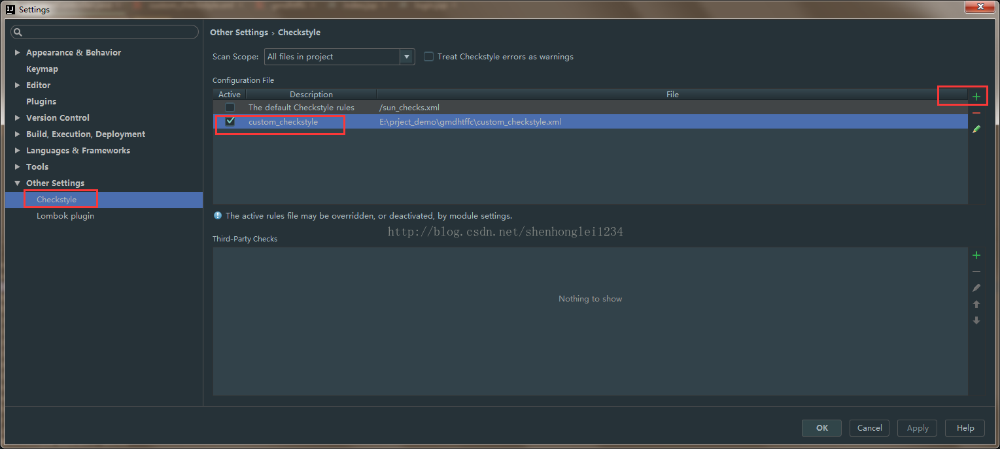
代码规范文件示例：
```xml
<?xml version="1.0"?>
<!DOCTYPE module PUBLIC
        "-//Puppy Crawl//DTD Check Configuration 1.3//EN"
        "http://www.puppycrawl.com/dtds/configuration_1_3.dtd">

<module name="Checker">
    <!--
        If you set the basedir property below, then all reported file
        names will be relative to the specified directory. See
        http://checkstyle.sourceforge.net/5.x/config.html#Checker
        <property name="basedir" value="${basedir}"/>
    -->
    <!-- 检查每个包中是否有java注释文件，默认有package-info.java -->
    <!-- <module name="JavadocPackage"/> -->
    <!-- 检查文件是否以一个空行结束 -->
    <module name="NewlineAtEndOfFile"/>

    <!-- 检查property文件中是否有相同的key -->
    <module name="Translation"/>
    <!-- 文件长度不超过1500行 -->
    <module name="FileLength">
        <property name="max" value="1500"/>
    </module>

    <!-- 检查文件中是否含有'\t' -->
    <module name="FileTabCharacter"/>

    <!-- Miscellaneous other checks. -->
    <module name="RegexpSingleline">
        <property name="format" value="\s+$"/>
        <property name="minimum" value="0"/>
        <property name="maximum" value="0"/>
        <property name="message" value="Line has trailing spaces."/>
    </module>

    <!-- 每个java文件一个语法树 -->
    <module name="TreeWalker">
        <!-- 注释检查 -->
        <!-- 检查方法和构造函数的javadoc -->
        <module name="JavadocMethod">
            <property name="tokens" value="METHOD_DEF" />
        </module>
        <!-- 检查类和接口的javadoc。默认不检查author和version tags -->
        <module name="JavadocType"/>
        <!-- 检查变量的javadoc -->
        <module name="JavadocVariable"/>
        <!-- 检查javadoc的格式 -->
        <module name="JavadocStyle">
            <property name="checkFirstSentence" value="false"/>
        </module>
        <!-- 检查TODO:注释 -->
        <module name="TodoComment"/>

        <!-- 命名检查 -->
        <!-- 局部的final变量，包括catch中的参数的检查 -->
        <module name="LocalFinalVariableName" />
        <!-- 局部的非final型的变量，包括catch中的参数的检查 -->
        <module name="LocalVariableName" />
        <!-- 包名的检查（只允许小写字母），默认^[a-z]+(\.[a-zA-Z_][a-zA-Z_0-9_]*)*$ -->
        <module name="PackageName">
            <property name="format" value="^[a-z]+(\.[a-z][a-z0-9]*)*$" />
            <message key="name.invalidPattern" value="包名 ''{0}'' 要符合 ''{1}''格式."/>
        </module>
        <!-- 仅仅是static型的变量（不包括static final型）的检查 -->
        <module name="StaticVariableName" />
        <!-- Class或Interface名检查，默认^[A-Z][a-zA-Z0-9]*$-->
        <module name="TypeName">
            <property name="severity" value="warning"/>
            <message key="name.invalidPattern" value="名称 ''{0}'' 要符合 ''{1}''格式."/>
        </module>
        <!-- 非static型变量的检查 -->
        <module name="MemberName" />
        <!-- 方法名的检查 -->
        <module name="MethodName" />
        <!-- 方法的参数名 -->
        <module name="ParameterName " />
        <!-- 常量名的检查（只允许大写），默认^[A-Z][A-Z0-9]*(_[A-Z0-9]+)*$ -->
        <module name="ConstantName" />

        <!-- 定义检查 -->
        <!-- 检查数组类型定义的样式 -->
        <module name="ArrayTypeStyle"/>
        <!-- 检查方法名、构造函数、catch块的参数是否是final的 -->
        <!-- <module name="FinalParameters"/> -->
        <!-- 检查long型定义是否有大写的“L” -->
        <module name="UpperEll"/>


        <!-- Checks for Headers                                -->
        <!-- See http://checkstyle.sf.net/config_header.html   -->
        <!-- <module name="Header">                            -->
        <!-- The follow property value demonstrates the ability     -->
        <!-- to have access to ANT properties. In this case it uses -->
        <!-- the ${basedir} property to allow Checkstyle to be run  -->
        <!-- from any directory within a project. See property      -->
        <!-- expansion,                                             -->
        <!-- http://checkstyle.sf.net/config.html#properties        -->
        <!-- <property                                              -->
        <!--     name="headerFile"                                  -->
        <!--     value="${basedir}/java.header"/>                   -->
        <!-- </module> -->

        <!-- Following interprets the header file as regular expressions. -->
        <!-- <module name="RegexpHeader"/>                                -->


        <!-- import检查-->
        <!-- 避免使用* -->
        <module name="AvoidStarImport"/>
        <!-- 检查是否从非法的包中导入了类 -->
        <module name="IllegalImport"/>
        <!-- 检查是否导入了多余的包 -->
        <module name="RedundantImport"/>
        <!-- 没用的import检查，比如：1.没有被用到2.重复的3.import java.lang的4.import 与该类在同一个package的 -->
        <module name="UnusedImports" />

        <!-- 长度检查 -->
        <!-- 每行不超过150个字符 -->
        <module name="LineLength">
            <property name="max" value="150" />
        </module>
        <!-- 方法不超过150行 -->
        <module name="MethodLength">
            <property name="tokens" value="METHOD_DEF" />
            <property name="max" value="150" />
        </module>
        <!-- 方法的参数个数不超过5个。 并且不对构造方法进行检查-->
        <module name="ParameterNumber">
            <property name="max" value="10" />
            <property name="ignoreOverriddenMethods" value="true"/>
            <property name="tokens" value="METHOD_DEF" />
        </module>

        <!-- 空格检查-->
        <!-- 方法名后跟左圆括号"(" -->
        <module name="MethodParamPad" />
        <!-- 在类型转换时，不允许左圆括号右边有空格，也不允许与右圆括号左边有空格 -->
        <module name="TypecastParenPad" />
        <!-- Iterator -->
        <!-- <module name="EmptyForIteratorPad"/> -->
        <!-- 检查尖括号 -->
        <!-- <module name="GenericWhitespace"/> -->
        <!-- 检查在某个特定关键字之后应保留空格 -->
        <module name="NoWhitespaceAfter"/>
        <!-- 检查在某个特定关键字之前应保留空格 -->
        <module name="NoWhitespaceBefore"/>
        <!-- 操作符换行策略检查 -->
        <module name="OperatorWrap"/>
        <!-- 圆括号空白 -->
        <module name="ParenPad"/>
        <!-- 检查分隔符是否在空白之后 -->
        <module name="WhitespaceAfter"/>
        <!-- 检查分隔符周围是否有空白 -->
        <module name="WhitespaceAround"/>


        <!-- 修饰符检查 -->
        <!-- 检查修饰符的顺序是否遵照java语言规范，默认public、protected、private、abstract、static、final、transient、volatile、synchronized、native、strictfp -->
        <module name="ModifierOrder"/>
        <!-- 检查接口和annotation中是否有多余修饰符，如接口方法不必使用public -->
        <module name="RedundantModifier"/>


        <!-- 代码块检查 -->
        <!-- 检查是否有嵌套代码块 -->
        <module name="AvoidNestedBlocks"/>
        <!-- 检查是否有空代码块 -->
        <module name="EmptyBlock"/>
        <!-- 检查左大括号位置 -->
        <module name="LeftCurly"/>
        <!-- 检查代码块是否缺失{} -->
        <module name="NeedBraces"/>
        <!-- 检查右大括号位置 -->
        <module name="RightCurly"/>


        <!-- 代码检查 -->
        <!-- 检查是否在同一行初始化 -->
        <!-- <module name="AvoidInlineConditionals"/> -->
        <!-- 检查空的代码段 -->
        <module name="EmptyStatement"/>
        <!-- 检查在重写了equals方法后是否重写了hashCode方法 -->
        <module name="EqualsHashCode"/>
        <!-- 检查局部变量或参数是否隐藏了类中的变量 -->
        <module name="HiddenField">
            <property name="tokens" value="VARIABLE_DEF"/>
        </module>
        <!-- 检查是否使用工厂方法实例化 -->
        <module name="IllegalInstantiation"/>
        <!-- 检查子表达式中是否有赋值操作 -->
        <module name="InnerAssignment"/>
        <!-- 检查是否有"魔术"数字 -->
        <module name="MagicNumber">
            <property name="ignoreNumbers" value="0, 1"/>
            <property name="ignoreAnnotation" value="true"/>
        </module>
        <!-- 检查switch语句是否有default -->
        <module name="MissingSwitchDefault"/>
        <!-- 检查是否有过度复杂的布尔表达式 -->
        <module name="SimplifyBooleanExpression"/>
        <!-- 检查是否有过于复杂的布尔返回代码段 -->
        <module name="SimplifyBooleanReturn"/>

        <!-- 类设计检查 -->
        <!-- 检查类是否为扩展设计l -->
        <!-- <module name="DesignForExtension"/> -->
        <!-- 检查只有private构造函数的类是否声明为final -->
        <module name="FinalClass"/>
        <!-- 检查工具类是否有putblic的构造器 -->
        <module name="HideUtilityClassConstructor"/>
        <!-- 检查接口是否仅定义类型 -->
        <module name="InterfaceIsType"/>
        <!-- 检查类成员的可见度 -->
        <module name="VisibilityModifier"/>


        <!-- 其他检查 -->
        <!-- 文件中使用了System.out.print等
        <module name="GenericIllegalRegexp">
            <property name="format" value="System\.out\.print"/>
        </module>
        <module name="GenericIllegalRegexp">
            <property name="format" value="System\.exit"/>
        </module>
        <module name="GenericIllegalRegexp">
            <property name="format" value="printStackTrace"/>
        </module>-->

        <!-- 代码质量 -->
        <!-- 圈复杂度
        <module name="CyclomaticComplexity">
              <property name="max" value="2"/>
        </module> -->
    </module>
</module>
```
3.在java文件中 右键选择**Check Current File**，进行代码检测。
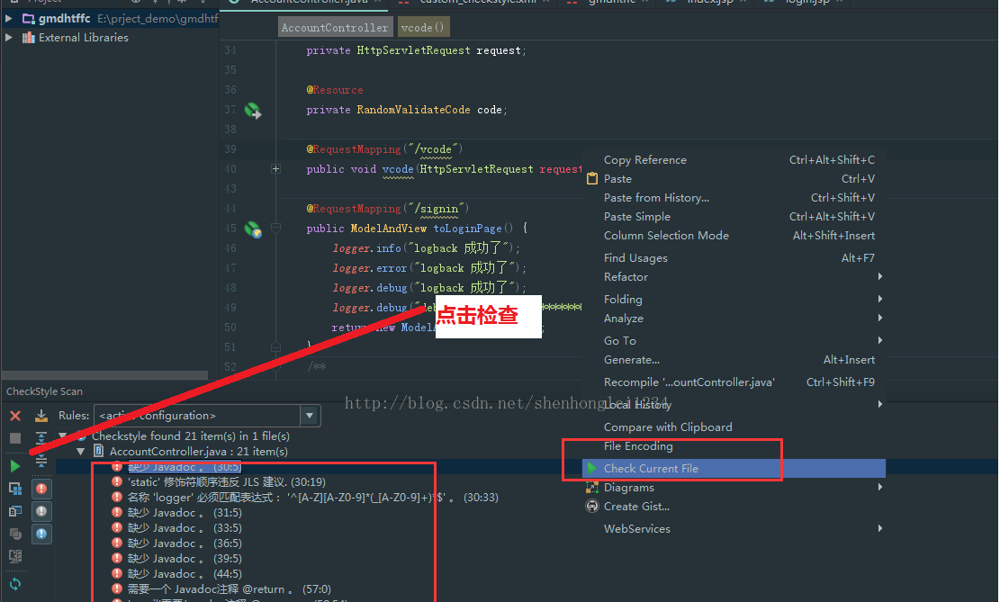


代码规范插件当然还有很多，例如PMD，FindBugs，Jtest等在这读者有兴趣，请自行安装使用。


# 二、代码编写类

### 1.Lombok plugin  ✔
lombok可以简化你的实体类，让你i不再写get/set方法，还能快速的实现builder模式，以及链式调用方法
官网 https://projectlombok.org/features/index.html
在idea安装了Lombok插件，并在项目中依赖这个**Lombok** jar，以maven为例：
```xml
        <dependency>
			<groupId>org.projectlombok</groupId>
			<artifactId>lombok</artifactId>
			<optional>true</optional>
		</dependency>
```
**@Getter / @Setter**
  可以作用在类上和属性上，放在类上，会对所有的非静态(non-static)属性生成Getter/Setter方法，放在属性上，会对该属性生成Getter/Setter方法。并可以指定Getter/Setter方法的访问级别。

**@EqualsAndHashCode**
  默认情况下，会使用所有非瞬态(non-transient)和非静态(non-static)字段来生成equals和hascode方法，也可以指定具体使用哪些属性。

**@ToString**
  生成toString方法，默认情况下，会输出类名、所有属性，属性会按照顺序输出，以逗号分割。

**@NoArgsConstructor, @RequiredArgsConstructor and @AllArgsConstructor**
  无参构造器、部分参数构造器、全参构造器，当我们需要重载多个构造器的时候，Lombok就无能为力了。

**@Data**
  @ToString, @EqualsAndHashCode, 所有属性的@Getter, 所有non-final属性的@Setter和@RequiredArgsConstructor的组合，通常情况下，我们使用这个注解就足够了。
**@Slf4j**
  提供了日志操作，在代码中直接使用log这个引用即可，例如log.info(...),log.error(....)等等
 
用法示例如图：
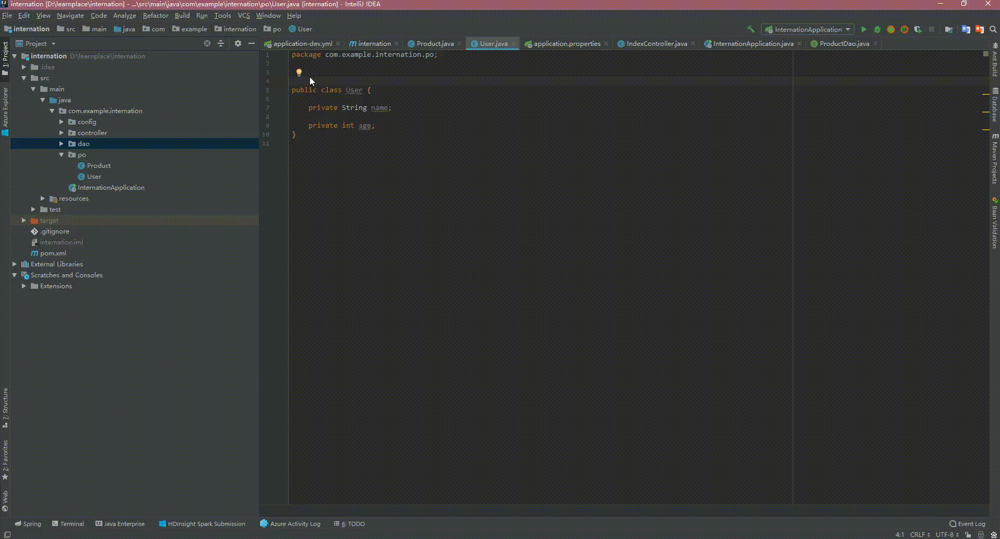

*注：idea中快捷键 **ALT+7** 查看类的字段、属性、方法,是否继承等*

当然该工具还提供了通过注解转换对应代码，示例如图：
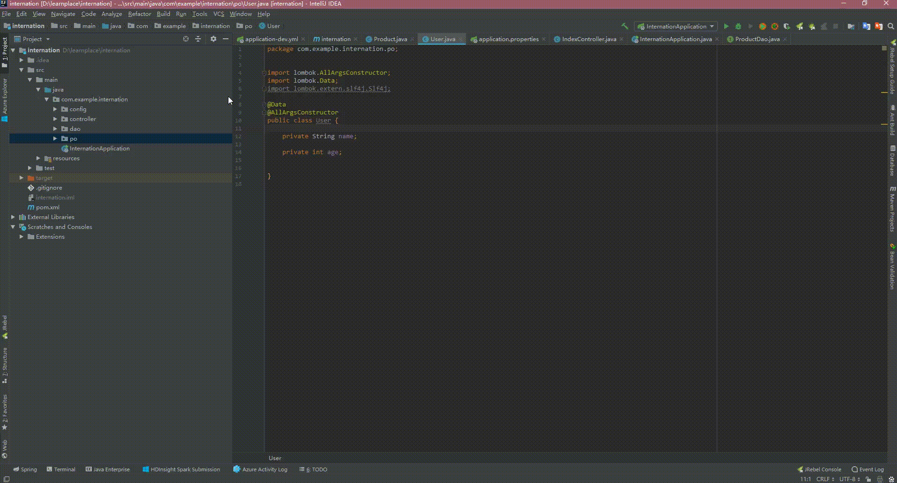


### 2.CamelCase
将不是驼峰格式的名称，快速转成驼峰格式。选中要修改的名称，按快捷键**shift+alt+u**。也可以通过不断的快捷键进行你想要的名称进行切换。
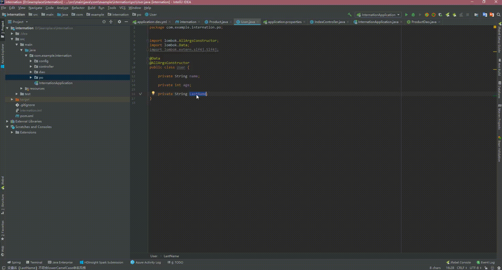

### 3.~~Mybatis plugin~~ 
可以在mapper接口中和mapper的xml文件中来回跳转，就想接口跳到实现类那样简单。但该插件并非免费，故推荐使用**Free Mybatis plugin**。
Mybatis Plugin插件安装破解及使用：[https://blog.csdn.net/u011410529/article/details/54098067](https://blog.csdn.net/u011410529/article/details/54098067)

### 4.Free Mybatis plugin  ✔
Free Mybatis plugin，让你的mybatis.xml像java代码一样编辑。我们开发中使用mybatis时时长需要通过mapper接口查找对应的xml中的sql语句，该插件方便了我们的操作。
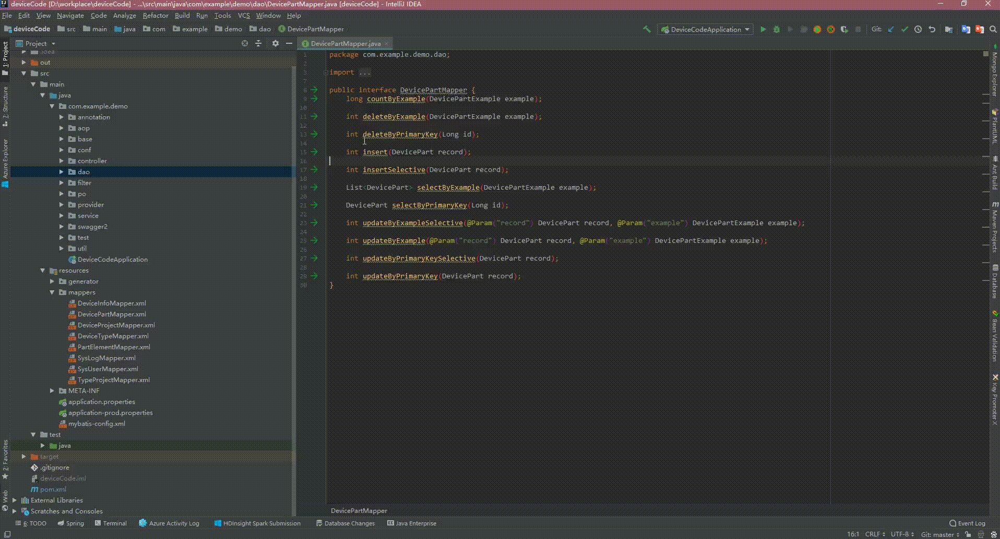

### 5.codehelper.generator  ✔
可以让你在创建一个对象并赋值的时候，快速的生成代码，不需要一个一个属性的向里面set,根据new关键字，自动生成掉用set方法的代码，还可以一键填入默认值。

GenAllSetter 特性

- 在Java方法中, 根据 new 关键词, 为Java Bean 生成所有Setter方法。

- 按GenAllSetter键两次, 会为Setter方法生成默认值。

- 可在Intellij Idea中为GenAllSetter设置快捷键。

- 如何使用:
  -  将光标移动到 new 语句的下一行。
  - 点击主菜单**Tools-> Codehelper-> GenAllSette**r, 或者按下GenAllSetter快捷键。

  GenDaoCode 特性
  - 根据Pojo 文件一键生成 Dao，Service，Xml，Sql文件。
  - Pojo文件更新后一键更新对应的Sql和mybatis xml文件。
  - 提供insert，insertList，update，select，delete五种方法。
  - 能够批量生成多个Pojo的对应的文件。
  - 自动将pojo的注释添加到对应的Sql文件的注释中。

  - 丰富的配置，如果没有配置文件，则会使用默认配置。
  - 可以在Intellij Idea中快捷键配置中配置快捷键。
  - 目前支持MySQL + Java，后续会支持更多的DB。
  - 如果喜欢我们的插件，非常感谢您的分享。

  GenDaoCode 使用方法
  - 主菜单**Tools-> Codehelper-> GenDaoCode** 按键便可生成代码。
  - 方法一：点击GenDaoCode，然后根据提示框输入Pojo名字，多个Pojo以 | 分隔。
  - Codehelper Generator会根据默认配置为您生成代码。
  - 方法二：在工程目录下添加文件名为*codehelper.properties*的文件。  
  - 点击GenDaoCode，Codehelper Generator会根据您的配置文件为您生成代码
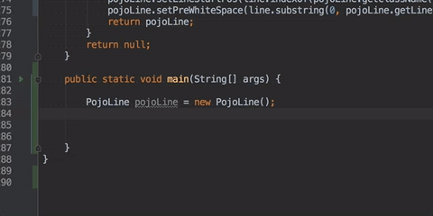

### 6.String Manipulation
强大的字符串转换工具。使用快捷键，**Alt+m**。
- 切换样式（camelCase, hyphen-lowercase, HYPHEN-UPPERCASE, snake_case, SCREAMING_SNAKE_CASE, dot.case, words lowercase, Words Capitalized, PascalCase）
- 转换为SCREAMING_SNAKE_CASE (或转换为camelCase)
- 转换为 snake_case (或转换为camelCase)
- 转换为dot.case (或转换为camelCase)
- 转换为hyphen-case (或转换为camelCase)
- 转换为hyphen-case (或转换为snake_case)
- 转换为camelCase (或转换为Words)
- 转换为camelCase (或转换为lowercase words)
- 转换为PascalCase (或转换为camelCase)
- 选定文本大写
- 样式反转


### 7.GsonFormat  ✔
一键根据json文本生成java类 。在类的内部，使用快捷键 **alt+s**
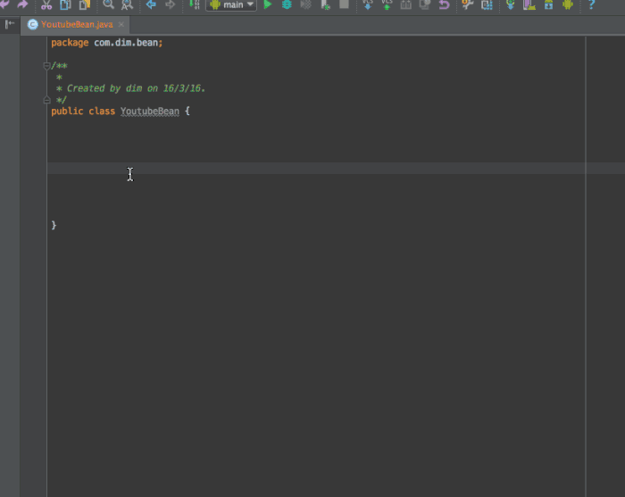


# 三、美观类

### 1.Background image Plus
1.在**View**->**Set Background Image**进行设置
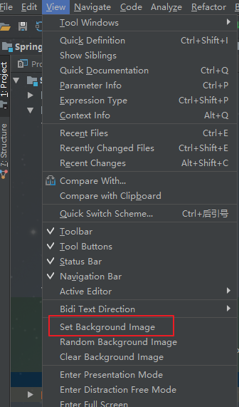

选择背景图：


### 2.Material Theme UI
这是一款主题插件，可以让你的ide的图标变漂亮，配色搭配的很到位，还可以切换不同的颜色，甚至可以自定义颜色。默认的配色就很漂亮了，如果需要修改配色，可以在工具栏中**Tools**->**Material Theme**然后修改配色等。
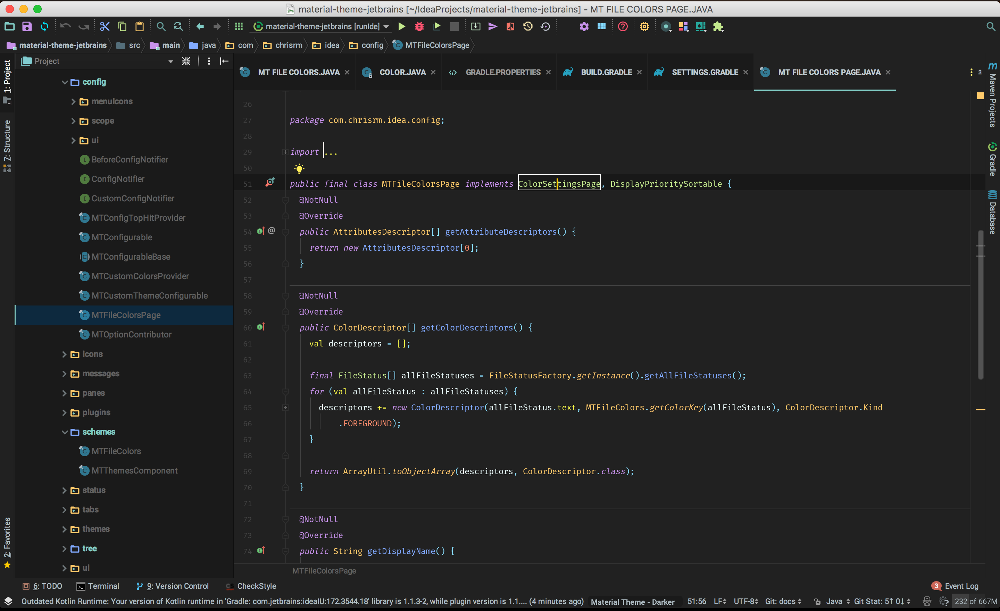

### 3.Nyan progress bar
这是一个将你idea中的所有的进度条都变成萌新动画的小插件。


### 4.Rainbow Brackets  ✔
彩虹颜色的括号  看着很舒服 敲代码效率变高


### 5.CodeGlance
在编辑代码最右侧，显示一块代码小地图，右侧面板有这个地图，拖动起来更加方便一点
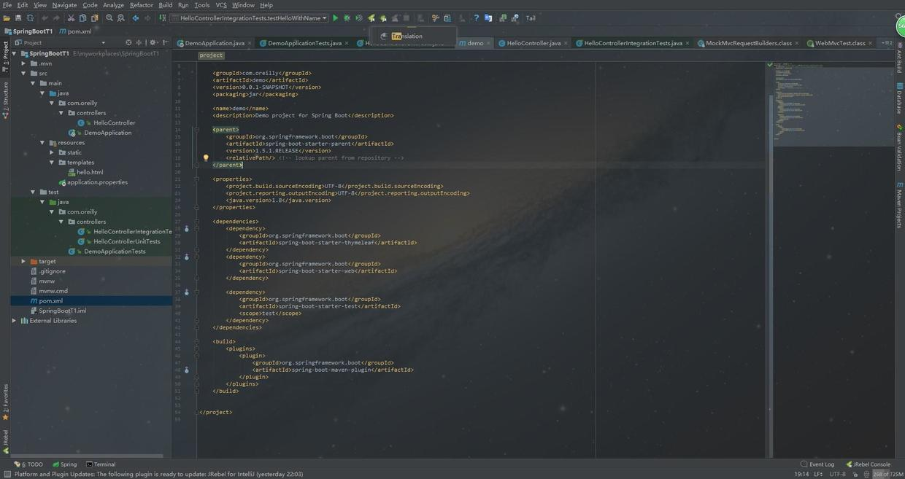

### 6.Grep Console  ✔
Grep Console 允许您定义一系列的正则表达式，利用它们来对控制台的输出或文件进行测试。每一个表达式匹配的行都会被整行的应用某个样式，或者播放声音。例如，你可以将错误消息设置为以红色的背景来显示。
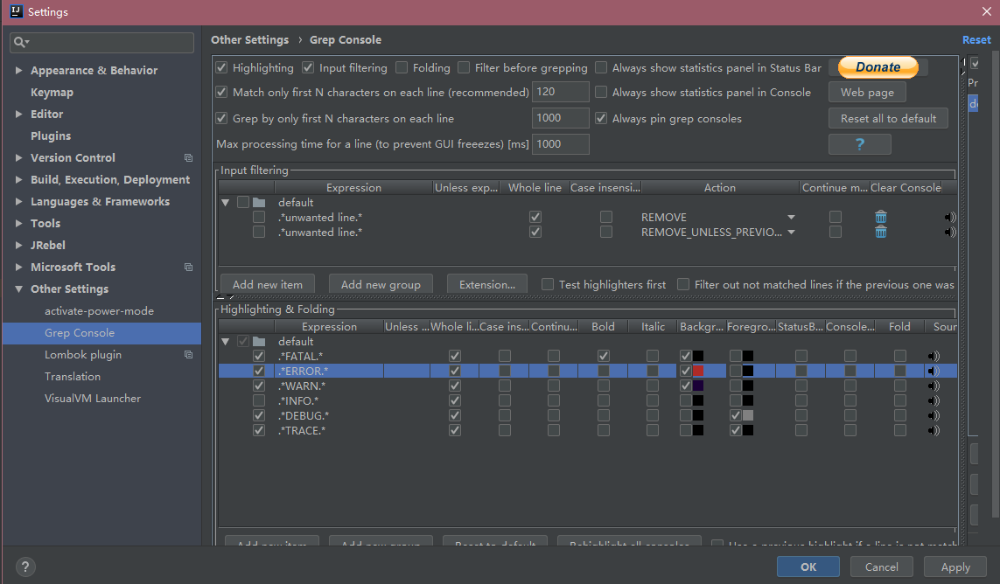

### 7.activate-power-mode
纯粹为了秀而存在的插件
个人推荐设置：Window-->activate-power-mode-->去掉combo/shake,其他三个全勾上
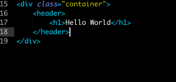

# 开发工具类

### 1.JRebel for Intellij ✔
JRebel是一个提升生产力的工具，它可以帮助开发人员快速的重新加载更改的代码。 它跳过了Java开发中常见的重新构建，重启以及重新部署的循环操作。 JRebel使开发人员能够在相同的时间内完成更多的工作，让开发人员的编码过程变得更加流畅。但该软件是收费的，破解教程：https://my.oschina.net/bluell/blog/1796575
1.用自己下载的tomcat运行项目
在Run/Debug Configurations面板 根据需要修改
```
  On ‘Update’ action : Update classes and resources 
  on frame deactivation : Update classes and resources 
```

2.springboot项目，采用springboot嵌套的tomcat
教程：https://www.jianshu.com/p/bdc88bef0af2

### 2.Translation  ✔
翻译插件，支持google翻译 百度翻译 有道翻译
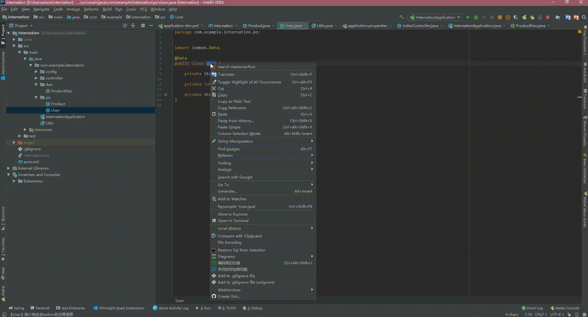

### 3.stackOverflow
  前提是需要网络能正常访问到google。


会对所选择的内容 进行google搜索
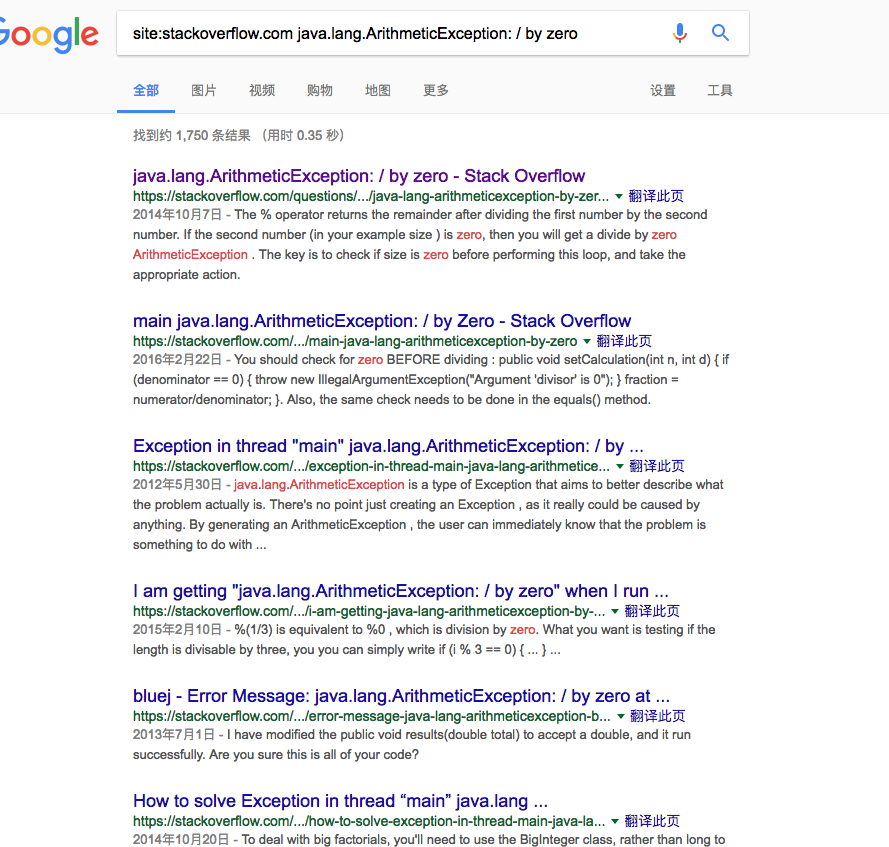

### 3.Key promoter X  ✔
  Key Promoter X 是一个提示插件，当你在IDEA里面使用鼠标的时候，如果这个鼠标操作是能够用快捷键替代的，那么Key Promoter X会在右下角弹出一个提示框，告知你这个鼠标操作可以用什么快捷键替代。

### 4.MyBatis Log Plugin  ✔
  MyBatis Log Plugin主要作用是把mybatis生成的PreparedStatement语句恢复成原始完整的sql语句。
它将用真实的参数值替换PreparedStatement语句的问号占位符。
通过 "Tools -> MyBatis Log Plugin" 这个菜单可以实时输出sql日志。
点击窗口左边的 "Filter" 按钮，可以过滤不想要输出的sql语句。
点击窗口左边的 "Format Sql" 按钮，可以格式化输出的sql语句
左边几个按钮的作用：
- Filter: 过滤语句配置
- Rerun: 重新启动
- Stop: 停止输出
- Format Sql: 格式化后续输出的Sql语句
- Close: 关闭该窗口


### 5.Markdown support 
  打开.md文件就可以通过一个支持md的视图查看和编辑内容。一般用于写README.md文件。 
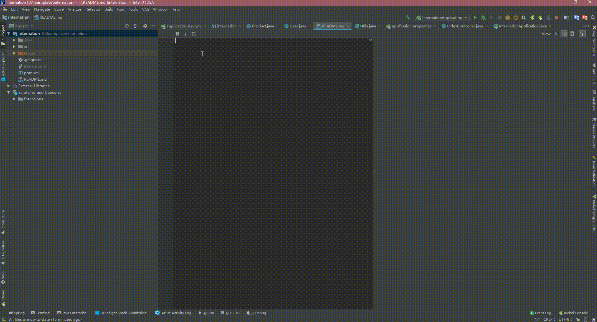


### 6.MetricsReloaded
所在位置**Analyze->Calculate Metrics**
>MetricsReloaded是一个计算代码复杂度即圈复杂度的Jetbrain开源开发的第三方插件。关于代码复杂度，有个维度的衡量，在这里需要普及下软件复杂度的相关知识：基本复杂度（Essential Complexity (ev(G))、模块设计复杂度（Module Design Complexity (iv(G))）、Cyclomatic Complexity (v(G))圈复杂度。
ev(G)基本复杂度是用来衡量程序非结构化程度的，非结构成分降低了程序的质量，增加了代码的维护难度，使程序难于理解。因此，基本复杂度高意味着非结构化程度高，难以模块化和维护。实际上，消除了一个错误有时会引起其他的错误。
Iv(G)模块设计复杂度是用来衡量模块判定结构，即模块和其他模块的调用关系。软件模块设计复杂度高意味模块耦合度高，这将导致模块难于隔离、维护和复用。模块设计复杂度是从模块流程图中移去那些不包含调用子模块的判定和循环结构后得出的圈复杂度，因此模块设计复杂度不能大于圈复杂度，通常是远小于圈复杂度。
v(G)是用来衡量一个模块判定结构的复杂程度，数量上表现为独立路径的条数，即合理的预防错误所需测试的最少路径条数，圈复杂度大说明程序代码可能质量低且难于测试和维护，经验表明，程序的可能错误和高的圈复杂度有着很大关系。

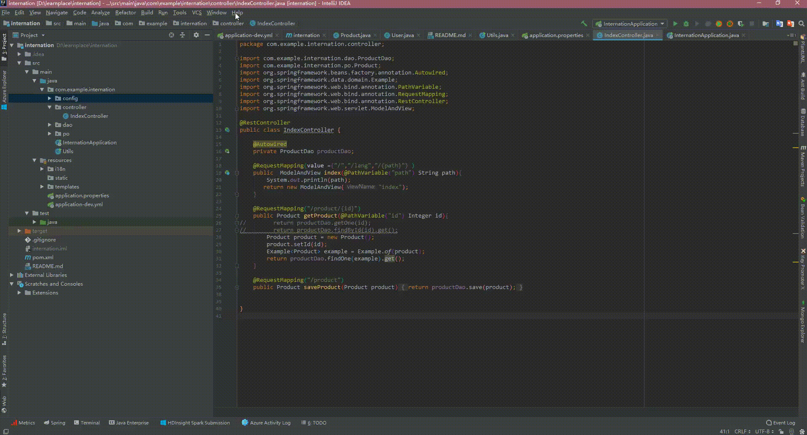

### 7.Maven Helper  ✔
在**pom.xml**中可以通过**Dependencies Analyzer** tab页进行查看包冲突，所有依赖的列表展示，以及所有依赖的树状图。并且还可以在**All Dependencies as Tree**中可以在节点中，可直接移除依赖。
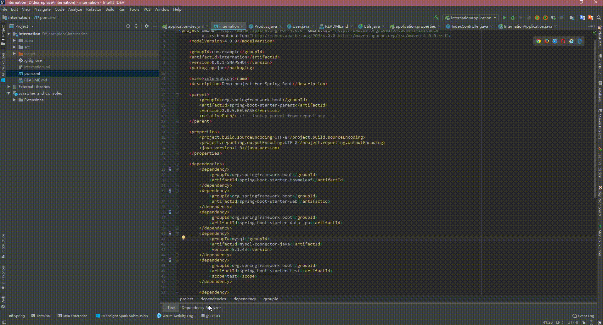

### 8.AceJump  ✔
AceJump其实是一款能够代替鼠标的软件，只要安装了这款插件，可以在代码中跳转到任意位置。按快捷键进入 AceJump 模式后（默认是 Ctrl+；），再按任空格，插件就会在屏幕中这个字符的所有出现位置都打上标签，你只要再按一下标签的字符，就能把光标移到该位置上。换言之，你要移动光标时，眼睛一直看着目标位置就行了，根本不用管光标的当前位置。
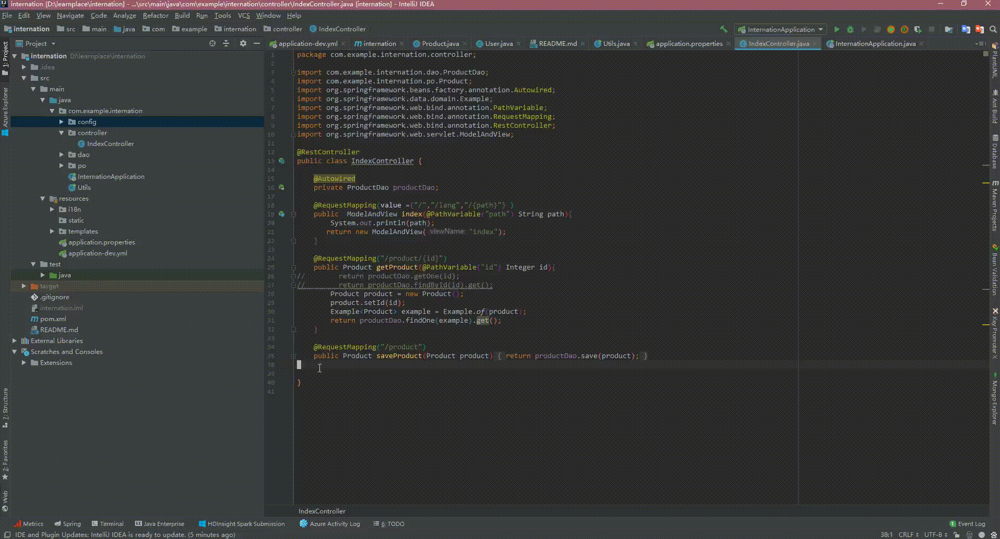

### 9.PlantUML integration
lantUML是一个快速创建UML图形的组件。但使用前需要安装graphviz，否则在渲染uml时会报错。


### 10.Alibaba Cloud Toolkit ✔
<font color=red>前提：你有阿里的云服务或者其他服务。</font>Cloud Toolkit 是本地 IDE 插件，帮助开发者更高效地开发、测试、诊断并部署应用。通过插件，您可以将本地应用一键部署到云端（ECS、EDAS 和 Kubernetes 等）和任意服务器；并且它还内置了 Arthas 程序诊断、Dubbo工具、Terminal Shell 终端和 MySQL 执行器等工具。
具体教程：https://www.aliyun.com/product/cloudtoolkit
这里举例：安装后 配置阿里云Host
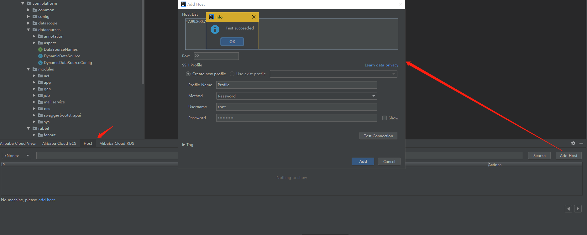
配置完成后 你可以使用如下常用操作：Upload 上传文件，Terminal 打开终端，Diagnostic 用Arthas 程序诊断。这里也推下arthas，教程移步至https://alibaba.github.io/arthas/


# 源码阅读工具
### 1. jclasslib bytecode viewer ✔
在已编译的java的class文件或者整个项目 。打开“**View**” 菜单，选择“**Show Bytecode With jclasslib**” 选项。 会弹出 jclasslib 工具窗口，而后从中选择自己感兴趣的类，方法查看它的字节码或者常量池等等信息。这样更加直观的学习jvm字节码。
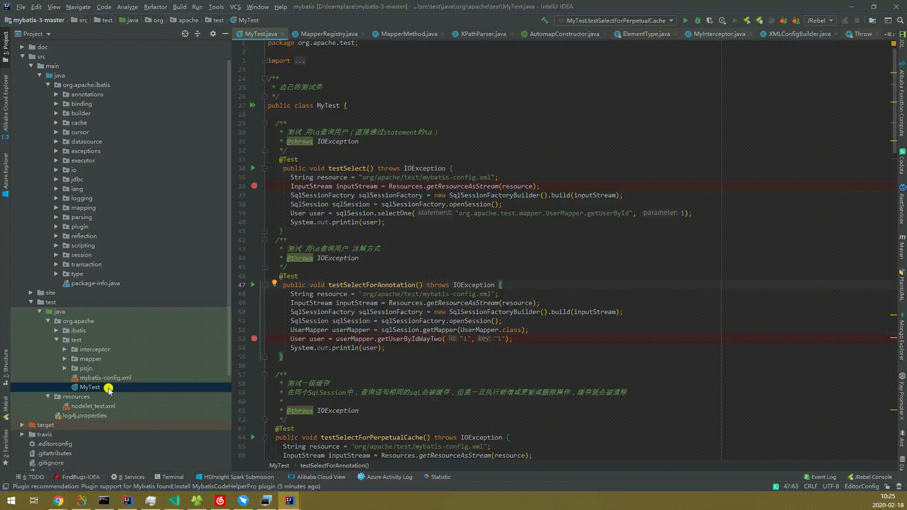
### 2.SequenceDiagram ✔
SequenceDiagram 可以根据代码调用链路自动生成时序图。在某个类的某个函数中，右键 --> **Sequence Diagaram** 即可调出，在弹出框可以自定义函数调用深度。
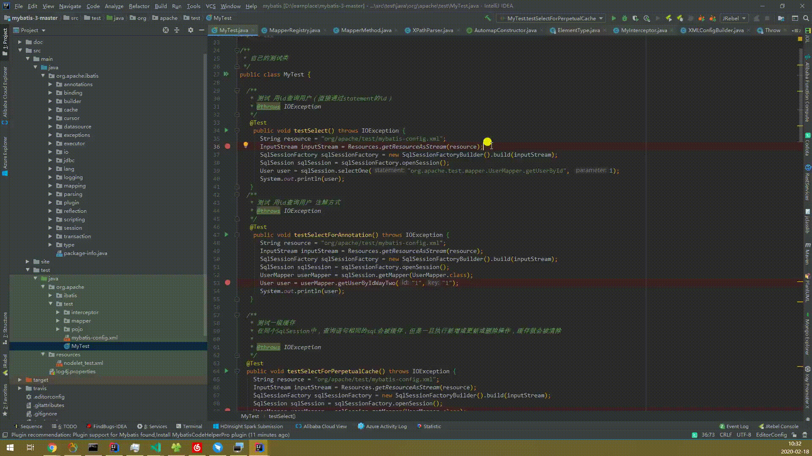
 
### 3.JOL Java Object Layout ✔
JOL Java Object Layout 安装完成后，可以最右侧侧边栏看到JOL。打开“**Code**” 菜单，选择“**Show Object Layout** ” 选项，就java 对象的大小。
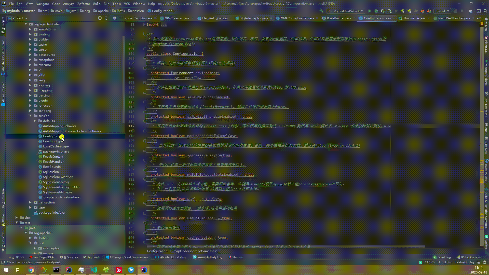

写在最后，在插件名后✔的是本人推荐使用。如果读者仍有优秀的插件可以推荐或者好的建议，希望留下您指间的字，在下方评论，一起完善史上最全系列。