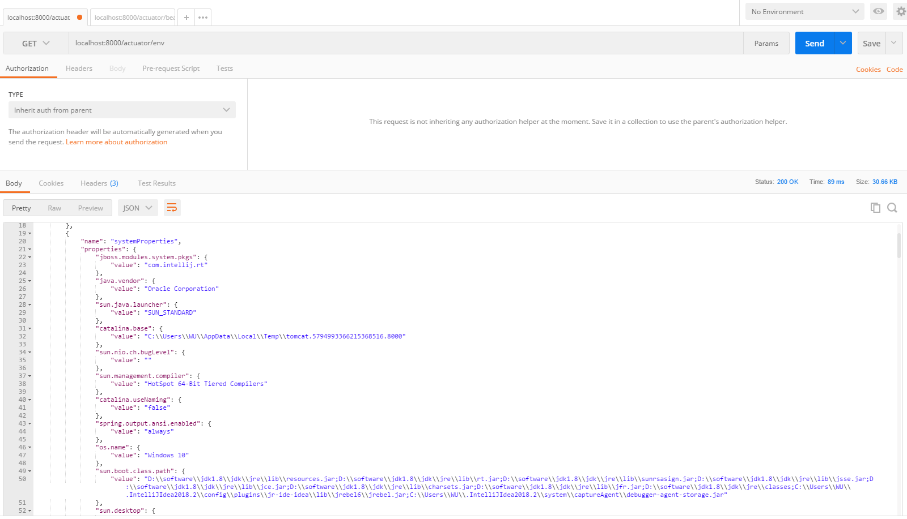

写在前面：本次采用的springboot的版本是2.X

# 第一步 添加actuator依赖
1.**pom.xml** 如下：
```xml
<?xml version="1.0" encoding="UTF-8"?>
<project xmlns="http://maven.apache.org/POM/4.0.0" xmlns:xsi="http://www.w3.org/2001/XMLSchema-instance"
         xsi:schemaLocation="http://maven.apache.org/POM/4.0.0 http://maven.apache.org/xsd/maven-4.0.0.xsd">
    <modelVersion>4.0.0</modelVersion>
    <parent>
        <groupId>org.springframework.boot</groupId>
        <artifactId>spring-boot-starter-parent</artifactId>
        <version>2.0.3.RELEASE</version>
        <relativePath/> <!-- lookup parent from repository -->
    </parent>
    <groupId>com.example</groupId>
    <artifactId>configuration</artifactId>
    <version>0.0.1-SNAPSHOT</version>
    <name>configuration</name>
    <description>Demo project for Spring Boot</description>

    <properties>
        <java.version>1.8</java.version>
    </properties>

    <dependencies>

		<!-- 引用actuator -->
        <dependency>
            <groupId>org.springframework.boot</groupId>
            <artifactId>spring-boot-starter-actuator</artifactId>
        </dependency>

        <dependency>
            <groupId>org.springframework.boot</groupId>
            <artifactId>spring-boot-starter-web</artifactId>
        </dependency>

        <dependency>
            <groupId>org.springframework.boot</groupId>
            <artifactId>spring-boot-starter-test</artifactId>
            <scope>test</scope>
        </dependency>
    </dependencies>

    <build>
        <plugins>
            <plugin>
                <groupId>org.springframework.boot</groupId>
                <artifactId>spring-boot-maven-plugin</artifactId>
            </plugin>
        </plugins>
    </build>

</project>

```

# 第二步 加入配置
1.**application.properties** 如下:
```xml
#web服务端端口
server.port=8000

#监控地址端口
management.server.port=8000

#springboot2.0之后，在Http环境下将默认的endpoint只设置为info和health，要想开启其他的监控功能，需要手动配置
management.endpoints.web.exposure.include=*


#请求连接前缀 默认是/actuator
management.endpoints.web.base-path=/actuator
```

# 第三步 启动验证
### 1.启动项目
日志信息中包含如下信息：


从上图可以看出我们将要测试的映射连接地址
### 2.使用浏览器或者Postman

1.**/actuator/env** 查看环境配置


2.**/actuator/beans** 查看所有的bean


*注：上诉内容根据用户自身环境显示*

3.**/actuator/health** 查看通过合并几个健康指数检查应用的健康情况

Spring Boot Actuator有几个预定义的健康指标比如`DataSourceHealthIndicator`, `DiskSpaceHealthIndicator`, `MongoHealthIndicator`, `RedisHealthIndicator`, `CassandraHealthIndicator`等。它使用这些健康指标作为健康检查的一部分。

举个例子，如果你的应用使用`Redis`，`RedisHealthindicator`将被当作检查的一部分。如果使用`MongoDB`，那么`MongoHealthIndicator`将被当作检查的一部分。

你也可以关闭特定的健康检查指标，比如在prpperties中使用如下命令：
```
management.health.mongo.enabled=false
```
默认，所有的这些健康指标被当作健康检查的一部分。

显示详细的健康信息
`health endpoint`只展示了简单的UP和DOWN状态。为了获得健康检查中所有指标的详细信息，你可以通过在`application.yaml`中增加如下内容：
```
management:
  endpoint:
    health:
      show-details: always
``` 


4.**/actuator/metrics** 查看可以追踪的所有的度量
想要获得每个度量的详细信息，你需要传递度量的名称到URL中，像
http://localhost:8000/actuator/metrics/{MetricName}


5.**/actuator/loggers** 展示了应用中可配置的loggers的列表和相关的日志等级。
你同样能够使用http://localhost:8000/actuator/loggers/{name}来展示特定logger的细节。

举个例子，为了获得root logger的细节，你可以使用http://localhost:8000/actuator/loggers/root：
```
{
   "configuredLevel":"INFO",
   "effectiveLevel":"INFO"
}
```
在运行时改变日志等级
`loggers endpoint`也允许你在运行时改变应用的日志等级。

举个例子，为了改变`root logger`的等级为`DEBUG` ，发送一个POST请求到`http://localhost:8080/actuator/loggers/root`，加入如下参数
```
{
   "configuredLevel": "DEBUG"
}
```
这个功能对于线上问题的排查非常有用。

同时，你可以通过传递`null`值给`configuredLevel`来重置日志等级。


# 第四步使用Spring Security来保证Actuator Endpoints安全 
Actuator endpoints是敏感的，必须保障进入是被授权的。如果Spring Security是包含在你的应用中，那么endpoint是通过HTTP认证被保护起来的。
```
<dependency>
   <groupId>org.springframework.boot</groupId>
   <artifactId>spring-boot-starter-security</artifactId>
</dependency>
```

在application.yaml中增加spring security用户 就使用这里配置的用户名/密码登录
```
spring:
  security:
    user:
      name: actuator
      password: actuator
      roles: ACTUATOR_ADMIN
```

编写安全认证ActuatorSecurityConfig配置类
```
import org.springframework.boot.actuate.autoconfigure.security.servlet.EndpointRequest;
import org.springframework.boot.actuate.context.ShutdownEndpoint;
import org.springframework.boot.autoconfigure.security.servlet.PathRequest;
import org.springframework.context.annotation.Configuration;
import org.springframework.security.config.annotation.web.builders.HttpSecurity;
import org.springframework.security.config.annotation.web.configuration.WebSecurityConfigurerAdapter;

@Configuration
public class ActuatorSecurityConfig extends WebSecurityConfigurerAdapter {

    @Override
    protected void configure(HttpSecurity http) throws Exception {
       http
               //开启登录配置
               .authorizeRequests()
               .requestMatchers(EndpointRequest.to(ShutdownEndpoint.class))
               //表示访问接口，需要具备 ACTUATOR_ADMIN 这个角色
               .hasRole("ACTUATOR_ADMIN")
               .requestMatchers(EndpointRequest.toAnyEndpoint())
               .permitAll()
               .requestMatchers(PathRequest.toStaticResources().atCommonLocations())
               .permitAll()
               .antMatchers("/")
               .permitAll()
               .antMatchers("/**")
               .authenticated()
               .and()
               .httpBasic();
    }
}

```

使用Postman请求，填上认证信息


注：Spring Security 支持两种不同的认证方式：
- 可以通过 form 表单来认证
- 可以通过 HttpBasic 来认证


将不一一进行演示，下表列出常用命令：

<table><thead><tr><th>HTTP方法</th>
			<th>路径</th>
			<th>描述</th>
			<th>鉴权</th>
		<tr><td>GET</td>
			<td>/actuator//configprops</td>
			<td>查看配置属性，包括默认配置</td>
			<td>true</td>
		</tr><tr><td>GET</td>
			<td>/actuator//beans</td>
			<td>查看bean及其关系列表</td>
			<td>true</td>
		</tr><tr><td>GET</td>
			<td>/actuator//threaddump</td>
			<td>打印线程栈</td>
			<td>true</td>
		</tr><tr><td>GET</td>
			<td>/actuator//env</td>
			<td>查看所有环境变量</td>
			<td>true</td>
		</tr><tr><td>GET</td>
			<td>/actuator//env/{toMatch}</td>
			<td>查看具体变量值</td>
			<td>true</td>
		</tr><tr><td>GET</td>
			<td>/actuator//health</td>
			<td>查看应用健康指标</td>
			<td>false</td>
		</tr><tr><td>GET</td>
			<td>/actuator//info</td>
			<td>查看应用信息（需要自己在application.properties里头添加信息，比如info.contact.email=easonjim@163.com）</td>
			<td>false</td>
		</tr><tr><td>GET</td>
			<td>/actuator//mappings</td>
			<td>查看所有url映射</td>
			<td>true</td>
		</tr><tr><td>GET</td>
			<td>/actuator//metrics</td>
			<td>查看应用基本指标</td>
			<td>true</td>
		</tr><tr><td>GET</td>
			<td>/actuator//metrics/{name}</td>
			<td>查看具体指标</td>
			<td>true</td>
	  <tr><td>GET</td>
			<td>/actuator//httptrace</td>
			<td>查看基本追踪信息</td>
			<td>true</td>
		</tr></tbody></table>